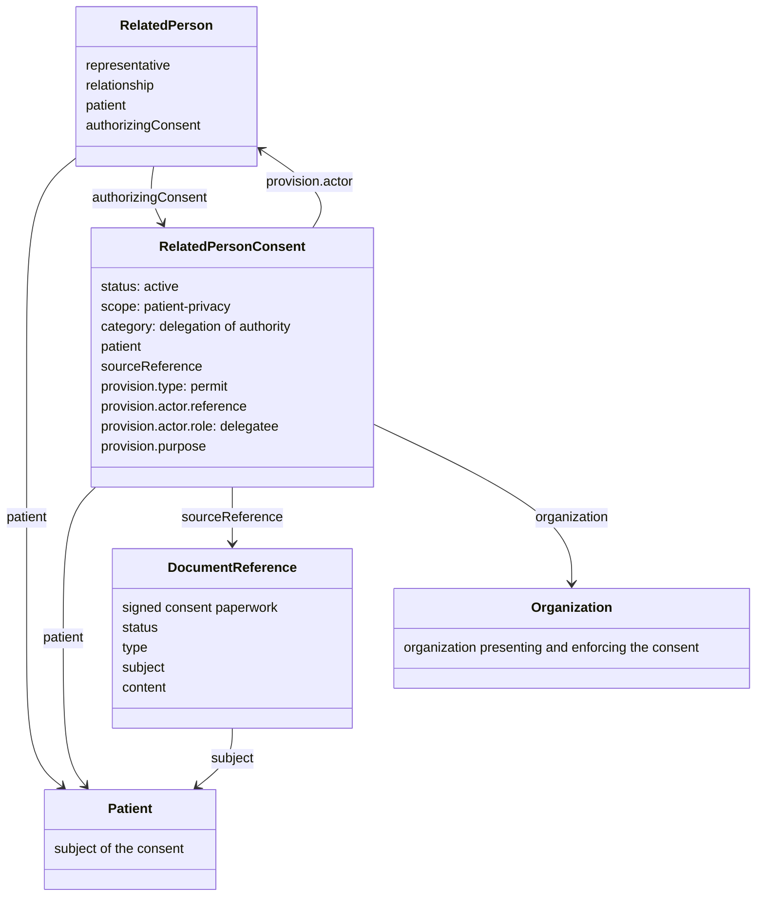

<div markdown="1" class="dragon">

This is an experimental IG.

</div>

<div class="note-to-balloters">

Note to balloters

</div>

<div class="stu-note">

STU Note

</div>

### Scope

This guide addresses situations in which a patient has a representative who may
act for the patient or access the patient's information. Examples include a
parent representing a minor, an adult appointing a Durable Power of Attorney (POA)
or a court appointing a representative.

The existence of a relationship and the authority granted through that
relationship are related but distinct facts. A `RelatedPerson` identifies the
person and their relationship to the patient. A `Consent` records the rationale,
authorization, and conditions that an organization can apply.

The guide does
not determine whether a person is legally entitled to act as a representative;
that determination and its supporting evidence remain the responsibility of the
implementing organization and applicable law.

### Solution

The guide defines a `RelatedPersonConsent` profile and an
`AuthorizedRelatedPerson` profile. The model:

- uses `Patient` to identify the person whose information or authority is at
  issue;
- uses `RelatedPerson` to identify the representative and their relationship to
  the patient;
- uses `Consent.provision.actor` to identify the related person authorized by
  the Consent;
- uses `Consent.sourceReference` to link the Consent to the signed paperwork or
  other source document; and
- uses the Consent's permit provisions, purpose, action, security label, class,
  period, and data elements to describe the scope of access when that scope must
  be enforced.

The `RelatedPersonConsent` profile requires an active patient-privacy Consent,
the patient, the presenting or enforcing organization, and at least one related
person as the provision actor. A source reference to the signed paperwork or
other legal instrument is recommended when that evidence can be exchanged and
the organization is authorized to publish it. The `AuthorizedRelatedPerson`
profile provides an optional `authorizingConsent` extension for systems that
want the RelatedPerson to point directly back to the Consent.

### Use Cases and Resource Model

The pattern applies whenever a representative relationship needs more context
than a relationship code can provide. Examples include a parent representing a
minor, an adult appointing a Durable Power of Attorney (POA), a representative
assigned because the patient lacks competency, or a court-appointed
representative.

The resource responsibilities are deliberately separate:

- `Patient` identifies the person whose information or authority is involved.
- `RelatedPerson` identifies the representative and their relationship to the
  patient.
- `Consent` records the authorization, rationale, and enforceable conditions.
- `DocumentReference` and, when appropriate, `Binary` retain the source
  paperwork.

The diagram shows how these resources support the pattern:



### Finding and Linking the Authorization

The `RelatedPerson.relationship` code identifies roles such as father, mother,
guardian, or lawyer, but it does not by itself grant access. The authorization
is found in the Consent that points to the same patient and identifies the
RelatedPerson in `Consent.provision.actor`.

An implementation can locate candidate Consents with the actor search parameter:

```http
GET [path]/Consent?actor=RelatedPerson/1234
```

The implementation should then confirm that the Consent is for the same patient,
is active and within its applicable period, and contains an applicable permit
provision for the related person. The following consistency rules describe the
intended links:

- `RelatedPerson.patient` matches `Consent.patient`.
- `Consent.provision.actor.reference` identifies the `RelatedPerson`.
- The Consent is applicable and permits the related person's authorized activity.

The optional `authorizingConsent` extension on `RelatedPerson` provides a direct
back-link for systems that want easier navigation. It creates a reciprocal
reference, so a REST workflow may need to create the RelatedPerson, create the
Consent, and then update the RelatedPerson with the Consent reference. Systems
that do not need the back-link can use the Consent actor search instead.

### Consent Profiling

The source paperwork may contain legal or organizational details that should not
be reduced to a single FHIR code. Capture that evidence in a `DocumentReference`
and, when appropriate, a `Binary`; the Consent's `sourceReference` points to the
document. The Consent is the organization's actionable interpretation of that
evidence, not a replacement for the source document.

The [RelatedPersonConsent profile](StructureDefinition-RelatedPersonConsent.html)
constrains the FHIR core [Consent](http://hl7.org/fhir/consent.html) for this
delegation use case:

- status - would indicate active
- category - would indicate patient consent, specifically a delegation of authority
- patient - would indicate the Patient resource reference for the given patient
- dateTime - would indicate when the privacy policy was presented
- performer - would indicate the Patient resource if the patient was presented, a RelatedPerson for parent or guardian
- organization - would indicate the Organization that presented the privacy policy, and that is going to enforce that privacy policy
- sourceReference - would point at the specific signed consent by the patient
- policy.uri - would indicate the privacy policy that was presented. Usually, the url to the version-specific policy
- provision.type - permit - authorizes the RelatedPerson as a delegatee; nested provisions may deny specific exceptions.
- provision.actor.reference - would indicate the RelatedPerson resource
- provision.actor.role - would indicate this actor is delegated authority
- provision.purpose - would indicate some set of [authorized purposeOfUse](ValueSet-AuthPurposesVS.html)

In cases where a court or another actor compels the relationship, rather than the
patient granting it, `Consent.performer` can identify the guardian, court, or
other responsible actor.

### Access-Control Use

An access-control engine can process the Consent provisions without inferring
authority from a relationship code. It can identify the requesting person as a
`RelatedPerson`, find the applicable Consent, and evaluate the permit rule for
the patient and requested purpose. It can then apply the provision's purpose,
action, security label, class, period, and data restrictions.

This pattern does not make every related person automatically authorized. The
organization must still evaluate the source evidence, policy, current status,
and applicable law before enforcing access.

### Representative Activities and Fine-Grained Restrictions

A representative may be permitted to perform activities beyond simply viewing
information. Candidate healthcare representative activities include:

- reviewing the patient's chart, notes, results, and care plans;
- requesting copies of records or authorizing disclosure to another person or
  organization;
- communicating with physicians, nurses, therapists, pharmacies, and other
  members of the care team;
- participating in care planning, referrals, discharge planning, and service
  coordination;
- scheduling, changing, or cancelling appointments;
- selecting providers, facilities, or services when the authority includes
  those decisions;
- advising on, agreeing to, declining, or withdrawing consent for examinations,
  procedures, medications, and other treatments;
- making decisions about admission, transfer, home care, rehabilitation, or
  hospice services;
- managing healthcare billing, insurance communication, and claims when those
  financial activities are included in the authority; and
- receiving notices and other communications needed to exercise the delegated
  healthcare authority.

Activities that should be considered for explicit restriction or separate
authorization include:

- access to specially protected mental-health, substance-use-disorder,
  reproductive-health, sexual-health, genetic, or infectious-disease records;
- disclosure of the patient's information to named third parties, employers,
  insurers, or organizations outside the care team;
- decisions to start, stop, or substantially change life-sustaining treatment;
- psychiatric admission, restraint, seclusion, or other behavioral-health
  interventions;
- participation in research, clinical trials, or secondary use of the patient's
  data;
- organ, tissue, or donation decisions;
- reproductive decisions or procedures;
- financial transactions beyond communicating with a payer or handling a
  healthcare claim; and
- actions that remain the patient's personal decision or require a separate
  legal appointment under applicable law.

These are candidate activity categories, not a statement of legal authority. A
system should represent permitted or denied activities using the Consent's
purpose, action, security label, class, period, and data elements when those
restrictions must be evaluated by an access-control engine. It should retain the
source legal instrument and document any activation, expiration, revocation, or
restriction that affects the decision.

The standard PurposeOfUse vocabulary does not provide a sufficiently fine-grained
code for every representative activity. For example, `PWATRNY` identifies a
request by a legal representative, but it does not distinguish reviewing records
from authorizing treatment, selecting a facility, approving a transfer, or
consenting to research enrollment. Codes such as `PATADMIN` or `CLINTRCH`, where
applicable, describe the context of information operations; they do not by
themselves grant the representative authority to make the underlying decision.

Implementations that need more than broad representative authorization should
define and bind appropriate fine-grained codes, preferably in a governed action
or purpose CodeSystem, or define a well-documented extension on
`Consent.provision`. Candidate codes could distinguish treatment authorization,
transfer authorization, research enrollment authorization, provider selection,
and authorization to disclose information to named parties. Those codes would
allow each activity to be represented by an independent permit or deny provision
and evaluated consistently by an access-control engine. Until such codes are
defined and legally mapped, the Consent should be understood as expressing only
the broad representative authority supported by the source legal instrument.

### Considerations

Given this setup, a newborn would need a Consent drafted as soon as that newborn has a Patient resource to enable the parents' access. This could be done by the system creating the newborn Patient resource. This could also be done using Implied Consent mechanisms, which is a default policy that is used when no Consent exists for a given Patient->agent relationship.

Same is true for any new Patient for which there is some precedent for implied consent representative.

Forcing a Consent to exist does prove that the representative relationship is explicit, and is thus more transparent. Implied representative relationships are common, but not very transparent.

### Workflow

The Consent resource is not intended to be used to drive the workflow of the capturing of the Consent. The Consent is following the "Event Pattern", which means that it is the output of an event.  The workflow that preceded this event would need to be managed by other resources in the [Request pattern](http://build.fhir.org/workflow.html#respatterns)

The Task resource is generic and can do this work. There are some specializations of Task, so we could end up at some kind of a Task derivative that is specific to the workflow leading up to a Consent. However it is first best to see if Task can be profiled to address the workflow.

For example a use-case where the Patient nominates a potential Person to become their RelatedPerson; that triggering a GP to review and approve it; that triggering some legal review and approval; resulting in a Consent instance and the creation of the RelatedPerson. This workflow could be profiled into an ActivityDefinition... I like the power of this modeling concept, but have not done it formally so am not sure of all the possible issues.

Note we have tried to keep workflow states out of the Consent.status; but some states have gotten in that I don't think are proper. But at this time we allow them in until there is a more formal task flow.

### Examples

Two examples given

#### Child delegating their Father

There is a basic example of a Patient delegating their father as their RelatedPerson. The resource objects are clickable to their examples.

<div>

</div>
<br clear="all">

- [Child Patient](Patient-ex-child.html)
- [Father as Related Person](RelatedPerson-ex-father.html)
- [Consent from the Patient authorizing the Father as a Related Person](Consent-ex-consent.html)

Note: This Consent simply indicates that the father is a delegatee for the child. This presumes that the definition of delegatee is clear enough, and that there are no restrictions on that "clear enough" definition. It might not be reasonable to assume that the delegatee is clear enough, and that there are no restrictions on that "clear enough" definition.  In that case, the consent would need to be more specific about what activities the father is allowed to do.

#### Elderly indicating a legal representative

Durable Power of Attorney (POA). Note that typically an Advanced Directive would be common along with this, this IG is not covering Advanced Directive.

- [Elderly Patient](Patient-ex-elderly.html)
- [Attorney](RelatedPerson-ex-attorney.html)
- [Consent authorizing Power of Attorney](Consent-ex-poa.html)

The Consent identifies the attorney as having a healthcare Power of
Attorney, but the purpose code alone does not establish every activity that the
attorney may perform. The legal instrument, its activation conditions, the
patient's capacity, and applicable jurisdiction determine the actual authority.
The Consent should make the organization's enforceable interpretation explicit
when a broad role is not sufficient.

In this example, the root permit is narrowed by nested deny provisions. The
attorney is denied access to patient data carrying the `R` (restricted) or `V`
(very restricted) confidentiality label, even though the attorney has broad
Power of Attorney authority for other permitted activities.
